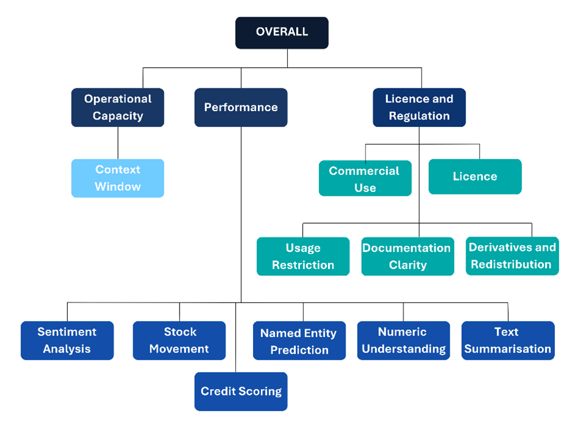
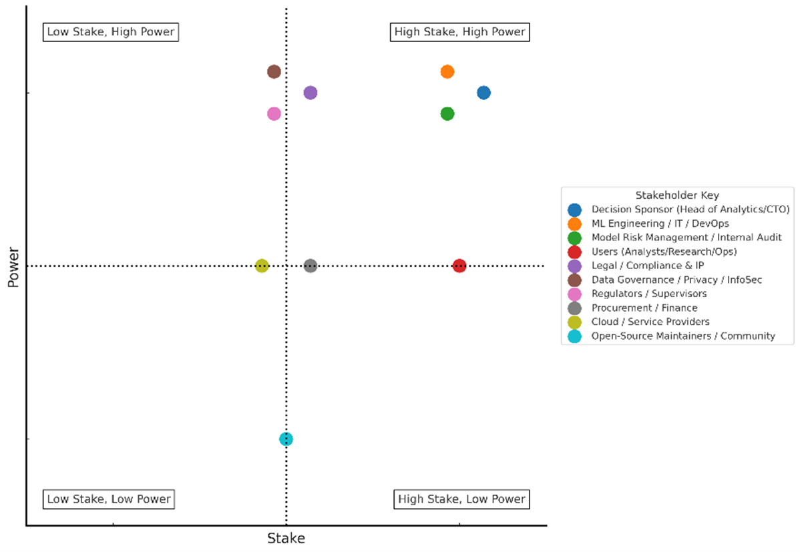
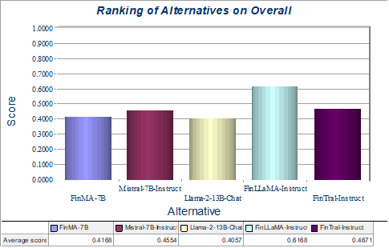
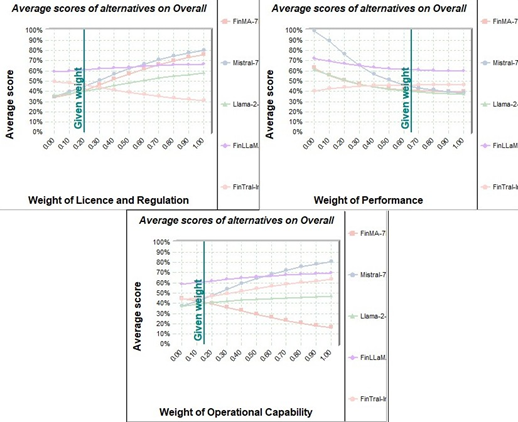
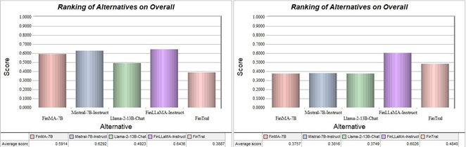

# Finance-Specific LLM Evaluation using MCDA

## Overview
This dissertation evaluates finance-specific Large Language Models (LLMs) using a Multi-Criteria Decision Analysis (MCDA) framework to identify the most suitable open-source model for real-world financial deployment.

The research combines:
- Financial NLP benchmark performance
- Operational deployment capability
- Licensing and regulatory feasibility

to create a transparent and defensible evaluation methodology for selecting finance-oriented LLMs in enterprise environments.

---

## Research Objective
The primary objective of this study is to evaluate open-source finance-focused LLMs across multiple operational and governance dimensions rather than relying solely on benchmark accuracy.

The dissertation addresses:
- Inconsistent benchmark comparisons across finance LLM literature
- Trade-offs between performance and governance
- Operational limitations such as context windows
- Licensing and regulatory deployment constraints

---

## Models Evaluated
- FinMA-7B
- FinTral-Instruct
- FinLLaMA-Instruct
- Llama-2-13B-Chat
- Mistral-7B-Instruct

---

## Evaluation Framework

### 1. Performance
- Sentiment Analysis
- Named Entity Recognition
- Numeric Understanding
- Text Summarisation
- Stock Movement Prediction
- Credit Scoring

### 2. Operational Capability
- Context Window
- Deployment feasibility
- Long-document processing capability

### 3. Licence & Regulation
- Commercial use permissions
- Redistribution rights
- Documentation clarity
- Usage restrictions
- Regulatory suitability

---

## Key Findings
- FinLLaMA-Instruct achieved the highest overall score due to strong and balanced financial task performance.
- FinTral showed strong benchmark performance but weaker governance feasibility due to licensing ambiguity.
- Mistral and FinMA performed better under compliance-heavy scenarios due to permissive licensing.
- Llama-2 underperformed across finance-specific task criteria.
- Benchmark performance alone is insufficient for enterprise deployment decisions.

---

## Sensitivity & Scenario Analysis
The dissertation includes:
- One-way sensitivity analysis
- Threshold analysis
- Scenario-based stakeholder analysis

Results indicate:
- FinLLaMA remains robust under performance-led scenarios.
- Mistral and FinMA outperform under compliance-heavy weighting scenarios.
- Ranking reversals occur when operational capability or licensing are disproportionately weighted.

---

## Visualisations

### Value Tree


### Stakeholder Analysis


### Overall Ranking


### One-Way Sensitivity Analysis


### Scenario Sensitivity Analysis


---

## Methodology
The dissertation applies:
- Multi-Criteria Decision Analysis (MCDA)
- Multi-Attribute Value Problem (MAVP)
- Weighted Sum Model (WSM)
- IDS Decision Support Software
- Sensitivity & Scenario Analysis

Scores were normalised into a common 0–1 scale to aggregate qualitative and quantitative criteria consistently.

---

## Tools & Sources

### Research & Evaluation
- IDS Decision Support Software
- Financial NLP Benchmarks
- Academic Literature
- Open-source Model Documentation

### Benchmarks Referenced
- FinBEN
- FinSet
- FLARE
- Financial PhraseBank
- FIQA-SA
- FinQA
- ConvFinQA

---

## Repository Structure

```bash
finance-llm-evaluation-mcda/
│
├── finance-llm-mcda-dissertation.pdf
├── README.md
│
└── visuals/
    ├── overall-ranking.png
    ├── value-tree.png
    ├── stakeholder-analysis.png
    ├── one-way-sensitivity-analysis.png
    └── scenarios-sensitivity-analysis.png
```

---

## Author
**Ananyasree Sandeep**  
MSc Business Analytics: Operational Research & Risk Analysis  
Alliance Manchester Business School

---

## Disclaimer
This repository is intended for academic and portfolio purposes only. The research findings are based on publicly available benchmarks, documentation, and literature available during the 2024–2025 evaluation period.
